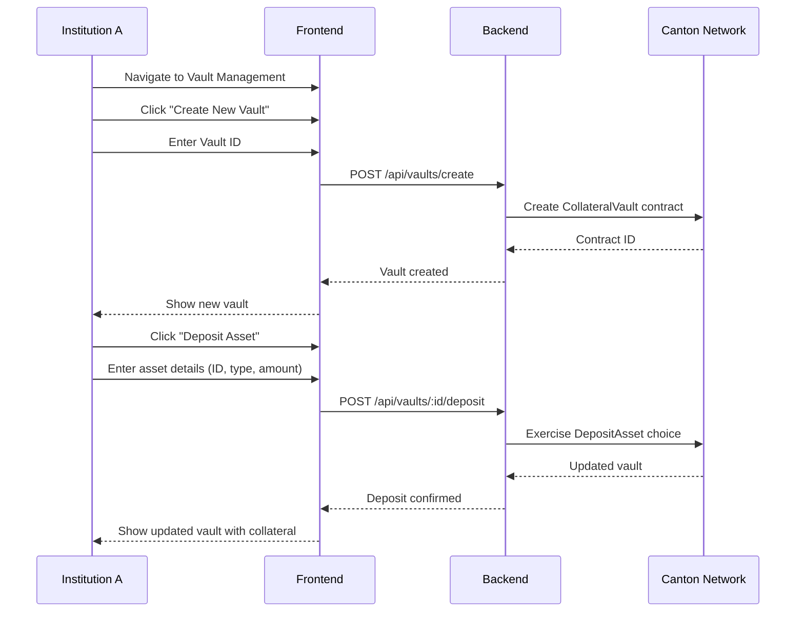
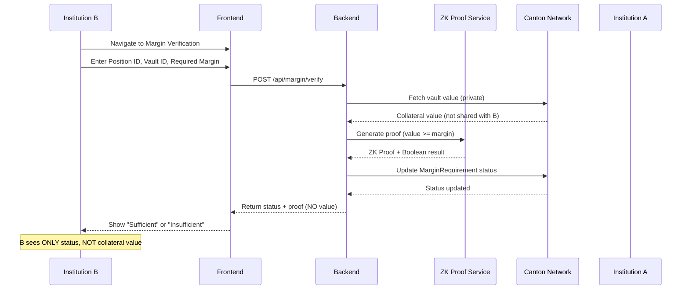
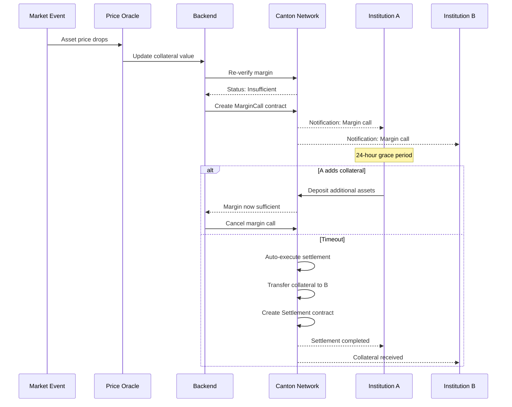

# PrivaMargin User Flows

## Flow 1: Vault Creation and Collateral Deposit

### Actors
- Institution A (Collateral Provider)
- Operator

### Steps



### User Experience

1. **Create Vault**
   - User clicks "Create New Vault" button
   - Enters unique Vault ID (e.g., "VAULT-A-001")
   - System creates empty vault
   - Vault appears in dashboard

2. **Deposit Assets**
   - User selects vault
   - Clicks "Deposit Asset"
   - Enters:
     - Asset ID (e.g., "USDC-001")
     - Asset Type (Stablecoin, RWA, Bond, Equity)
     - Amount (e.g., 500000)
   - System calculates USD value using oracle
   - Asset added to vault
   - Total vault value updates

### Privacy Note
- Vault contents are private to Institution A and Operator
- Institution B cannot see vault composition

---

## Flow 2: Margin Verification (Privacy-Preserving)

### Actors
- Institution A (Collateral Provider)
- Institution B (Counterparty)
- Operator

### Steps



### User Experience

**Institution B's View**:

1. **Request Verification**
   - Navigate to Margin Verification page
   - Enter:
     - Position ID (e.g., "POS-001")
     - Vault ID (e.g., "VAULT-A-001")
     - Required Margin (e.g., $800,000)
   - Click "Verify Margin"

2. **View Result**
   - System shows:
     - ✅ **Sufficient** or ❌ **Insufficient**
     - ZK Proof hash
     - Timestamp
     - Privacy indicator: "Collateral value NOT disclosed"
   - System does NOT show:
     - Actual collateral value
     - Asset composition
     - Individual asset amounts

**Institution A's View**:

1. **Monitor Verification**
   - Receives notification of verification request
   - Can see full vault details (private)
   - Knows exact margin coverage

### Privacy Guarantee

```
Institution B Input:
- Required Margin: $800,000

Institution B Output:
- Status: "Sufficient"
- Proof: "eyJjb21taXRtZW50IjoiTVRBd01EQXdNQT09..."
- Timestamp: "2025-12-02T16:30:00Z"

Institution B CANNOT see:
- Collateral Value: $1,000,000 ❌
- Assets: [USDC: $500k, RWA: $500k] ❌
```

---

## Flow 3: Margin Call and Automated Settlement

### Actors
- Institution A (Collateral Provider)
- Institution B (Counterparty)
- Operator

### Steps



### User Experience

**Scenario: Collateral Value Drops**

1. **Margin Call Triggered**
   - Market event causes asset price drop
   - Collateral value falls below required margin
   - System automatically creates margin call
   - Both parties notified

2. **Institution A's Options**
   - **Option 1**: Add more collateral
     - Deposit additional assets to vault
     - System re-verifies margin
     - If sufficient, margin call cancelled
   - **Option 2**: Settle manually
     - Transfer required amount to Institution B
     - Close position
   - **Option 3**: Wait (risky)
     - After 24 hours, automatic settlement

3. **Automated Settlement**
   - If not resolved in 24 hours:
     - Smart contract automatically executes
     - Required collateral transferred to Institution B
     - Settlement contract created
     - Both parties receive confirmation
   - Privacy maintained:
     - Only A and B see settlement details
     - Other parties cannot see transaction

**Settlement Dashboard View**:

```
┌─────────────────────────────────────┐
│ Active Margin Calls                 │
├─────────────────────────────────────┤
│ Position: POS-001                   │
│ Required: $800,000                  │
│ Status: Active ⚠️                   │
│ Time Remaining: 18 hours            │
│                                     │
│ [Settle Margin Call]                │
└─────────────────────────────────────┘
```

---

## Flow 4: Multi-Asset Collateral Management

### Scenario
Institution A wants to use diverse collateral basket

### Steps

1. **Mint Various Assets**
   - USDC (Stablecoin): $500,000
   - Real Estate Token (RWA): $500,000
   - Corporate Bond Token: $200,000
   - Tech Stock Token (Equity): $100,000

2. **Create Vault**
   - Create single vault for all assets
   - Deposit each asset type
   - System calculates total value: $1,300,000

3. **Link to Multiple Positions**
   - Link vault to Position 1 (requires $600k)
   - Link vault to Position 2 (requires $400k)
   - Total requirements: $1,000,000
   - Remaining buffer: $300,000

4. **Monitor in Real-Time**
   - Dashboard shows:
     - Asset distribution pie chart
     - Total value with live updates
     - Margin coverage per position
     - Risk indicators

---

## Flow 5: Counterparty Verification (B's Perspective)

### What Institution B Can Do

1. **Request Verification**
   - Enter position details
   - Submit verification request
   - Receive instant result

2. **View Status**
   - See Sufficient/Insufficient
   - View ZK proof hash
   - Check timestamp

3. **Trigger Margin Call**
   - If insufficient, can trigger margin call
   - System notifies Institution A
   - Track resolution

### What Institution B CANNOT Do

❌ View collateral value
❌ See asset composition
❌ Access vault contents
❌ Know exact margin coverage
❌ See other positions

### Privacy Indicators in UI

```
┌─────────────────────────────────────┐
│ Verification Result                 │
├─────────────────────────────────────┤
│ Status: ✅ Sufficient               │
│                                     │
│ 🔒 Privacy Protected                │
│ Collateral value is NOT disclosed  │
│ to counterparty. Only verification │
│ status is shared via zero-knowledge│
│ proof.                              │
│                                     │
│ ZK Proof: eyJjb21taXRtZW50Ij...    │
│ Verified: 2025-12-02 16:30:00      │
└─────────────────────────────────────┘
```

---

## Key User Benefits

### For Collateral Providers (Institution A)
- ✅ Maintain portfolio privacy
- ✅ Use diverse collateral types
- ✅ Automated margin monitoring
- ✅ Flexible collateral management

### For Counterparties (Institution B)
- ✅ Verify margin sufficiency
- ✅ No need to trust provider's claims
- ✅ Cryptographic proof of adequacy
- ✅ Automated risk management

### For Both Parties
- ✅ Reduced operational costs
- ✅ Faster settlement
- ✅ Regulatory compliance
- ✅ Audit trail on blockchain
